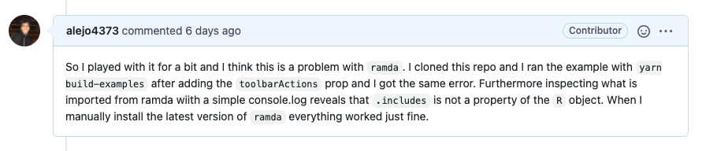
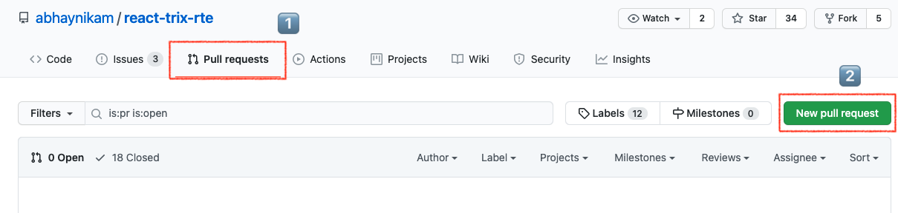
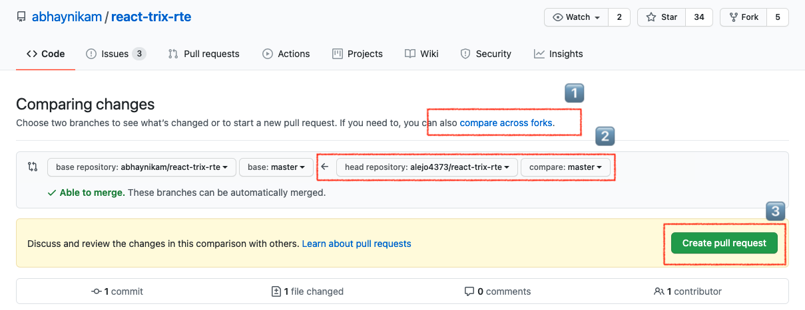
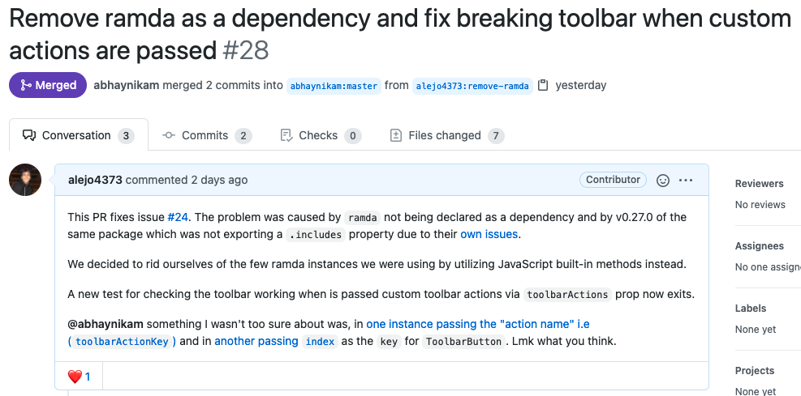

# Bug Hunting: How to find and fix a bug in a 3rd party React library

A few weeks ago, around March 11, I was shopping for a Text editor for a Todo and Journal App I'm building on the side, trying a few of options available I found a bug.

I was browsing for an RTE editor (Rich Text Editor) to use with React in [npmjs.com](https://www.npmjs.com/), and I found hundreds of them; from the ones found I considered [react-quilljs](https://www.npmjs.com/package/react-quilljs) and [react-trix-rte](https://www.npmjs.com/package/react-trix-rte). I settled for react-trix-rte because its a simple and humble editor and because it uses [Trix](https://trix-editor.org/) which is the text editor of Basecamp, and since Basecamp is my dream company I figured I get aquatinted with their tech sooner rather than later.

Unfortunately or not, I found a bug in the `react-trix-rte` library as I started to set it up for my use case. The bug I found happen to show up when I passed a specific prop to the component.

The steps bellow are the steps I used for tracking down the bug and fixing it. Finding and fixing any bug has roughly the same steps.

1. Spotting the bug
2. Searching if anyone else has come across the bug
   1. Engaging with existing GitHub issue or opening a new issue
3. Confirm the bug by reproducing it in isolation
4. Fixing the bug
   1. Forking and setting up the project/lib
   2. Tracking the bug
   3. Making the fix
   4. Writing a test that checks for the bug (TDD says do this first)
5. Submitting a PR

Upon installing react-trix-rte with `npm i react-trix-rte` on my project I instantiated the component with the default settings. Like so:

```jsx
import "trix";
import React, { useState } from "react";
import { ReactTrixRTEInput } from "react-trix-rte";

export default function TrixEditor(props) {
  const [value, setValue] = useState("");

  function handleChange(event, newValue) {
    setValue(newValue); // OR custom on change listener.
  }

  return (
    <ReactTrixRTEInput
      defaultValue="<div>React Trix Rich Text Editor</div>"
      onChange={handleChange}
    />
  )
}
```

## Spotting the Bug

The problem came when I wanted to customize the toolbar of the editor by passing the `toolbarActions` prop to only show the buttons I wanted, in this case a button to **bold** and **link** text and an **undo** button:

```jsx
// TrixEditor.js 
import { ReactTrixRTEInput, ReactTrixRTEToolbar } from "react-trix-rte";
//...rest of the content redacted for brevity
return (
  <>
    <ReactTrixRTEToolbar
      toolbarId="trix-toolbar"
      toolbarActions={["bold", "link", "undo"]}
    />
    <ReactTrixRTEInput
      defaultValue="<div>React Trix Rich Text Editor</div>"
      onChange={handleChange}
      toolbarId="trix-toolbar"
    />
  </>
)
```

After adding the `toolbarActions` prop for `ReactTrixRTEToolbar` my app crashed with the following error.

```js
Uncaught TypeError: p.includes is not a function
    at A (index.js:1)
    at renderWithHooks (react-dom.development.js:14985)
    at updateFunctionComponent (react-dom.development.js:17356)
    at beginWork (react-dom.development.js:19063)
    at HTMLUnknownElement.callCallback (react-dom.development.js:3945)
    at Object.invokeGuardedCallbackDev (react-dom.development.js:3994)
    at invokeGuardedCallback (react-dom.development.js:4056)
    at beginWork$1 (react-dom.development.js:23964)
    at performUnitOfWork (react-dom.development.js:22776)
    at workLoopSync (react-dom.development.js:22707)
    at renderRootSync (react-dom.development.js:22670)
    at performSyncWorkOnRoot (react-dom.development.js:22293)
    at react-dom.development.js:11327
    at unstable_runWithPriority (scheduler.development.js:468)
    at runWithPriority$1 (react-dom.development.js:11276)
    at flushSyncCallbackQueueImpl (react-dom.development.js:11322)
    at flushSyncCallbackQueue (react-dom.development.js:11309)
    at flushSync (react-dom.development.js:22467)
    at Object.scheduleRefresh (react-dom.development.js:24429)
    at react-refresh-runtime.development.js:304
    at Set.forEach (<anonymous>)
    at Object.performReactRefresh (react-refresh-runtime.development.js:293)
    at RefreshUtils.js:62
```

### How to rule out the bug is not yours

1. Find the line in your code that triggers the bug. In my case that was the line where I passed `toolbarActions`. Without it the bug didn't show up.
2. After confirming the trigger, carefully read the error and the stack trace and verify it does not mention any of your own files.
3. Search your code for the part specific piece of code that is breaking. In my case I did a search to check if I was using `.includes` anywhere in my code, I got no results. 

The steps above confirmed the bug was not in my code.


## Searching if anyone else has come across the bug

Once confirmed the bug is in a 3rd party package and not your code, the next step is to search its issues or pull requests in the package GitHub repository to see if someone already found the issue and reported it, or if there is a fix underway.

Searching for `.includes` in the issues section of the repo did not yield any results, so I searched for `"toolbarActions"` and bingo! An issue had been reported by a user by the handle @AxxxxOn

### Engaging with existing GitHub issue or opening a new issue

The search yielded an issue with the title ["**Crash when using ReactTrixRTEToolbar with toolbarActions**"](https://github.com/abhaynikam/react-trix-rte/issues/24), exactly what I was experiencing. In the conversation taking place in the issue the user @AxxxxOn had made a PR that claimed to fix the issue so I asked when the new version would be available in NPM.

After a few days a new version had been released (v.1.0.11) which I was eager to try out. To my surprise after downloading the latest version of the package my app was still crashing with the original error, so I decided to take a closer look.

## Confirm the bug by reproducing it in isolation

I wanted to report back that I was still experiencing the issue and that the alleged fix did not address it.

To reproduce bugs in isolation developers write the least amount of code possible that triggers the issue. It is pretty much standard for developers to share their reproduction of the issue with one of the following tools, then sharing a url to the reproduction with other developers to study the problem.

* [CodeSanbox.io](https://codesandbox.io/). Specially good for react apps, you can use npm
* [Repl.it](https://repl.it/). Can use npm but setup is necessary
* [Codepen.io](https://codepen.io/). Mostly for HTML, CSS & vanilla JS or jQuery can use npm
* [jsfiddle](https://jsfiddle.net/). HTML, CSS, JS only. Cannot use npm.
* Creating a repo with the least amount of code that demonstrates the bug

What I did was create a minimal codesandbox with the latest version of the library and verify I was still getting the issue when I passed the `toolbarActions` props. I then when back to the original issue and [notified the participants I was still having the issue](https://github.com/abhaynikam/react-trix-rte/issues/24#issuecomment-805503145)

## Investigating & Fixing the bug

As I was curious and wanted to try to figure out the issue I started digging.

### Tracking the bug

The first step was to find the source of the bug, to find it I used the clue I had gotten earlier which was the bug having something to do with `.includes`. So I did a search in react-trix-rte's GitHub Repo for the keyword `.includes` and I got a match in the file [ReactTrixRTEToolbar.jsx](https://github.com/abhaynikam/react-trix-rte/blob/0113900270ac04612ee32cf325c2d5a4f7b67536/src/components/ReactTrixRTEToolbar/ReactTrixRTEToolbar.jsx#L60) where `R.includes()` appeared.

```js
// src/components/ReactTrixRTEToolbar/ReactTrixRTEToolbar.jsx 
import * as R from "ramda";
//...rest of the content redacted for brevity

  function renderToolbarLinkDialog() {
    if (isToolbarActionPresent && R.includes("link", toolbarActions)) {
      return <ToolbarLinkDialog />;
    } else if(!isToolbarActionPresent) {
      return <ToolbarLinkDialog />;
    }
  }
```

From here I learned `.includes` was part of a library called [Ramda](https://ramdajs.com/) which is a "A practical functional library for JavaScript programmers." that promises "Immutability and side-effect free functions" and "make it very easy to build functions as sequences of simpler functions".

### Forking and setting up the project/lib

I wanted to take a closer look by running `react-trix-rte` locally, so I forked the project and then cloned it to my computer. I installed the dependencies with `yarn install` (react-trix-rte uses yarn instead of npm), modified `Example.js` to pass the `toolbarActions` prop and ran it with `yarn start`

The same crash happened.

```js
Uncaught TypeError: R.includes is not a function
```

As I had the project locally and I wanted to inspect why `R` didn't have seem to have a `.includes` I decided to add a `debugger` in `ReactTrixRTEToolbar.jsx` to inspect the `R` object

```js
// src/components/ReactTrixRTEToolbar/ReactTrixRTEToolbar.jsx 
import * as R from "ramda";
//...rest of the content redacted for brevity

  function renderToolbarLinkDialog() {
    debugger
    if (isToolbarActionPresent && R.includes("link", toolbarActions)) {
      return <ToolbarLinkDialog />;
    } else if(!isToolbarActionPresent) {
      return <ToolbarLinkDialog />;
    }
  }
```

Then I ran the project again with `yarn start`

Open the developer tools in Google Chrome and I could when the debugger latched in I saw the `R` object was there but it did not have a property/function `.includes`. I then went to the ramda GitHub repo and searched `.includes` in the issues section but I got no strong results.

I decided to check what version of ramda the react-trix-rte was using and found it was v0.27.0 which was not the latest version v0.27.1.

I installed the latest version of `ramda` with `yarn install ramda` and ran the example again and the problem was gone. It turned out ramda v0.27.0 had [some problems](https://github.com/ramda/ramda/issues/3064).


### Making the fix

So the problem wasn't mine or react-trix-rte, it was ramda's. They had broken something in v0.27.0 and fixed it in v0.27.1. This meant the bug I was experiencing had at least three ways of being fixed:

1. Update the Ramda dependency to use the latest version.
2. Get rid of Ramda altogether and use built-in methods instead
3. Use the built in method `.includes` instead of using Ramda's for this one line of code

At this point I went back to the original issue in react-trix-rte ([Crash when using ReactTrixRTEToolbar with toolbarActions](https://github.com/abhaynikam/react-trix-rte/issues/24)) and I shared my findings in the following [comment](https://github.com/abhaynikam/react-trix-rte/issues/24#issuecomment-805545453).



The author of the package suggested I submit a PR request since I had found the root cause of the bug. In the discussion that followed we decided to go with fix #2 because the project didn't rely on ramda too heavily and because using Ramda meant the size of package would be greater.

To get rid of Ramda altogether I needed to locate all instances `ramda` was being used in, so I searched the project for `from "ramda"` which located all files where ramda was being imported. The results showed `ramda` was being used in two files [`ReactTrixRTEToolbar.js`](https://github.com/abhaynikam/react-trix-rte/blob/0941e4802b928812bf82c0639ff0c0f9a2e85709/src/components/ReactTrixRTEToolbar/ReactTrixRTEToolbar.jsx) & [`utils.js`](https://github.com/abhaynikam/react-trix-rte/blob/0941e4802b928812bf82c0639ff0c0f9a2e85709/src/components/Shared/utils.js). The ramda functions that were being used were:

* `R.mapObjIndexed()`
* `R.not()`
* `R.isEmpty()`
* `R.pick()`
* `R.includes()`
* `R.keys()`
* `R.addIndex()`
* `R.map()`

The next step, which took the longest, was to learn what these functions were doing and replace them with JavaScript built in functions. The functions were not too hard to understand once I had read the code that was using them and read [ramda's documentation](https://ramdajs.com/docs/)

I proceeded to replace them one my one and checking that all the existing tests were passing by running `yarn test`

### Writing a test that checks for the bug

After verifying that the existing test were passing and double checking manually that `ReactTrixRTEToolbar` was no longer crashing when `toolbarActions` was passed, the next step was to write an automated test for it.

You can see the test bellow, I basically renders the `ReactTrixRTEToolbar` component and checks that there are 3 buttons (ToolbarButtonGroup), one for each action in `toolbarActions`

[src/components/ReactTrixRTEToolbar/ReactTrixRTEToolbar.test.js](https://github.com/abhaynikam/react-trix-rte/blob/master/src/components/ReactTrixRTEToolbar/ReactTrixRTEToolbar.test.js)

```js
import React from 'react';
import { shallow } from 'enzyme';
import ReactTrixRTEToolbar from './ReactTrixRTEToolbar';
import ToolbarButtonGroup from "./ToolbarComponent/ToolbarButtonGroup";

//...rest of the content redacted for brevity

  it('renders toolbar with specified toolbarActions', () => {
    let toolbarActions = ["bold", "indent", "undo"]
    const wrapper = shallow(<ReactTrixRTEToolbar toolbarActions={toolbarActions} />);
    expect(wrapper.find(ToolbarButtonGroup)).toHaveLength(3);
  });
```

The test passed with my changes and it failed if I reverted to use ramda. Beautiful 🎉!

## Submitting a Pull Request

The last step was to create a PR against the author's react-trix-rte repo. First I had to make sure I had committed and pushed my changes to my fork on GitHub, then open a PR by going to react-trix-rte original repo Pull Request's Tab



Then selecting my fork to compare the forks



Last I gave the PR a title and detailed the reasons why I was opening it and what it fixed.



You can see the full PR [here](https://github.com/abhaynikam/react-trix-rte/pull/28). It was merged yesterday 3/28/2021 and the [latest version of react-trix-rte](https://github.com/abhaynikam/react-trix-rte/releases/tag/1.0.13) which was released a few hours ago (3/29/2021, 1:07:47 PM) includes my fix.

## Parting thoughts

Don't be intimidated of looking into code that it is not yours, specially when you come across an issue and you have ruled it being yours.

* 🕯 I have fixed many bugs by attempting to reproduce them in isolation and with the least amount of code. This removes the superfluous code and we can catch where our mistake is more easily or rule out if the bug is in our code.
* 👶  It is much easier to find bugs in young libraries
* 🔢  When you are investigating a bug know the versions of the packages you are using and see if the issue is something that happens with the latest version too.
* 🧪  In TDD (Test Driven Development) writing tests always happens first. For a bug writing a test that checks for it would usually the first step to catching it. You write a test that exposes the bug, and at some point as you are fixing the bug the test will pass which will let you know you exterminated the bug.

## Vocabulary

* WYSIWYG: What you see is what you get
* RTE: Rich Text Editor
